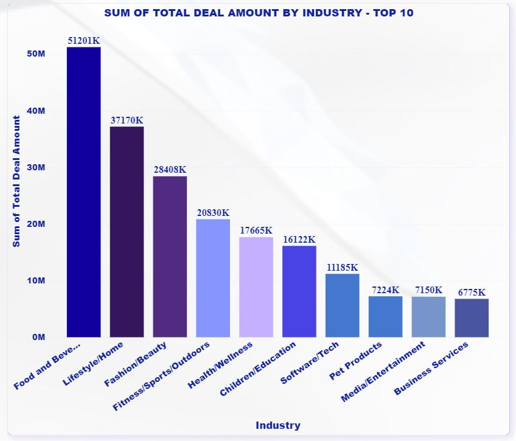
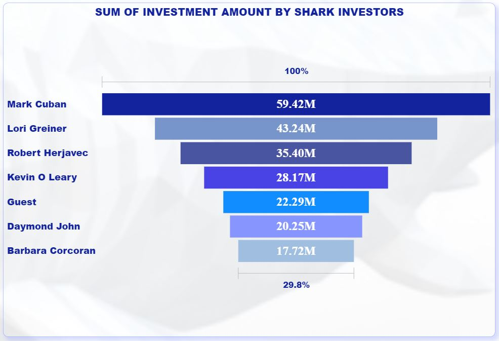

# Shark-Tank-US-Analysis-Challenge-dataDNA
This analysis presents deeper exploration and present insights on Shark Tank US dataset

The shark tank US dataset has 14 seasons. Season start date 09-Aug-2009 to 23-Sept-2022, and season end 05-Feb-2010 to date 19-May-2023.
There were pitches from several start-up companies accross 16 industries.

There were 7 different Shark Investors named below: 
1. Barbara Corcoran may be most famous for being a Shark, having appeared on all 14 seasons of ABC’s Shark Tank. In 2023, Corcoran has an estimated net worth of around $100 million.
2. Cuban is the richest shark. According to Forbes, Mark Cuban has a $5.1 billion net worth.
3. Lori Greiner’s net worth reportedly sits at an impressive $150 million in 2023 — a product of not only her millions in retail sales but the investments she’s made on Shark Tank.
4. Robert has an estimated net worth of $300 million.
5. In 2023, Daymond John is worth an estimated $350 million.
6. Kevin O’Leary has an estimated net worth of $400 million in 2023.
7. Also, there were Guest Investors also.

The offered amount was less than the requested amount and the requested equity was greater than the offered equity for the maximum deals. Additionally, the contract appraisal fell short of the requested valuation.
Additionally, there is a positive correlation between the total number of pitches and the number of deals sealed, indicating that participation maximizes the probability of conversion.

# Download pdf. and pbix. file for the detailed and comprehensive report
